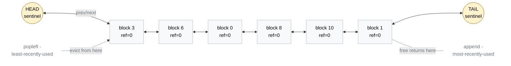

# mini-vllm

A from-scratch reimplementation of vLLM's core engine (~1.5k LOC target) — built
to internalize PagedAttention, continuous batching, and prefix caching.

**Status:** Week 1 of 4. Block allocator + KV-cache manager only; no forward
pass yet. See [`v0.1.0-blocks`](https://github.com/ashishSrivastava-19/mini-vllm/releases/tag/v0.1.0-blocks).

## What's in `v0.1.0-blocks`

The KV-cache memory manager. No hashing, eviction, or caching yet (Week 3).

- **`Sequence`** — one in-flight request: token ids, status, `block_table` (logical → physical block id).
- **`KVCacheBlock`** — one block of KV memory (default 16 tokens) with a ref count and free-list pointers.
- **`FreeKVCacheBlockQueue`** — doubly-linked list with sentinel head/tail; O(1) `popleft` / `append` / `remove(block)`.
- **`BlockManager`** — sole owner of ref counts and the free queue.

### Why a doubly-linked list?

Three ops, all needed in O(1):

| Op | When | Notes |
|---|---|---|
| `popleft()` | allocate a fresh block | hot path on admission |
| `append(b)` | ref count hits 0 | hot path on completion |
| `remove(b)` | (Week 3) cached block reused, ref 0 → 1 | makes prefix-cache lookup O(1) |

`deque` covers (1) and (2) but not (3); a list covers none. Storing prev/next
pointers on the block itself plus sentinel nodes gives all three with no edge cases.



- **`popleft()`** unlinks the node right after `HEAD` — the LRU candidate. In Week 3 this becomes the eviction victim when the cache is full.
- **`append(b)`** links a node right before `TAIL` — most recently freed.
- **`remove(b)`** unlinks a node from the middle using its own `prev_free_block` / `next_free_block` pointers. Used in Week 3 when a cached block (ref=0, sitting in the queue) gets reused — its ref count goes 0 → 1 so it must come out of the queue.

Sentinels mean every real block always has both `prev_free_block` and `next_free_block` set, never `None` — no empty/single-node edge cases.

### Block table

Each `Sequence` carries a `block_table: list[int]` — the i-th entry is the
physical block id holding logical block i. Two sequences can hold any mix
of physical blocks; nothing requires contiguity. This is the whole point of
paged attention: KV memory is allocated like OS virtual memory, not as a
contiguous array per sequence.

```mermaid
flowchart TB
    subgraph Pool["Physical KV-Cache Pool (block_size=16)"]
        direction LR
        P0["block 0"]
        P1["block 1"]
        P2["block 2<br/>tokens 16-31<br/>of seq A"]
        P3["block 3"]
        P4["block 4<br/>tokens 48-49<br/>of seq A"]
        P5["block 5<br/>tokens 0-15<br/>of seq B"]
        P6["block 6"]
        P7["block 7<br/>tokens 0-15<br/>of seq A"]
        P8["block 8"]
        P9["block 9<br/>tokens 16-19<br/>of seq B"]
        P10["block 10"]
        P11["block 11<br/>tokens 32-47<br/>of seq A"]
    end

    subgraph SeqA["Sequence A — 50 prompt tokens, needs 4 blocks"]
        direction LR
        A0["logical 0<br/>tokens 0-15"]
        A1["logical 1<br/>tokens 16-31"]
        A2["logical 2<br/>tokens 32-47"]
        A3["logical 3<br/>tokens 48-49"]
        A0 --- A1 --- A2 --- A3
    end

    subgraph SeqB["Sequence B — 20 tokens, needs 2 blocks"]
        direction LR
        B0["logical 0<br/>tokens 0-15"]
        B1["logical 1<br/>tokens 16-19"]
        B0 --- B1
    end

    A0 -.->|block_table[0]=7| P7
    A1 -.->|block_table[1]=2| P2
    A2 -.->|block_table[2]=11| P11
    A3 -.->|block_table[3]=4| P4

    B0 -.->|block_table[0]=5| P5
    B1 -.->|block_table[1]=9| P9

    classDef used fill:#d4edda,stroke:#28a745,color:#000
    classDef free fill:#f8f9fa,stroke:#adb5bd,color:#6c757d
    class P2,P4,P5,P7,P9,P11 used
    class P0,P1,P3,P6,P8,P10 free
```

A 50-token prompt with `block_size=16` needs ⌈50/16⌉ = 4 blocks.
`block_table = [7, 2, 11, 4]` means logical 0→7, 1→2, 2→11, 3→4 (last block
holds 2/16 slots).

When the scheduler calls `append_slots(seq, 1)` on a full last block, the
`BlockManager` pops a free block, appends its id to the table, and bumps
its ref count to 1.

## Layout

```
mini_vllm/
  engine/         # top-level LLM engine + request lifecycle
  scheduler/      # batching / preemption policy
  block_manager/  # paged KV-cache block allocator
  model_runner/   # forward-pass driver per worker
  layers/         # attention / MLP / norm / sampler kernels
  sampling/       # logits processors, samplers
  utils/          # shared helpers
```

## Setup & dev

```bash
uv sync                  # base deps
uv run pytest            # 68 passing
uv run ruff check .      # lint
```

## What's next

- **Week 2** — scheduler (FCFS + token budget), iteration loop, sampler, end-to-end `engine.generate()` matching HF greedy decoding.
- **Week 3** — FlashAttention, prefix caching with xxhash, LRU eviction.
- **Week 4** — CUDA graph capture, throughput/latency benchmarks vs vLLM.

## References

Mirrors `vllm/v1/core/block_pool.py`. See the
[PagedAttention paper](https://arxiv.org/abs/2309.06180),
[Inside vLLM](https://blog.vllm.ai/2025/09/05/anatomy-of-vllm.html), and the
[vLLM design doc](https://docs.vllm.ai/en/latest/design/paged_attention/).

## License

MIT
